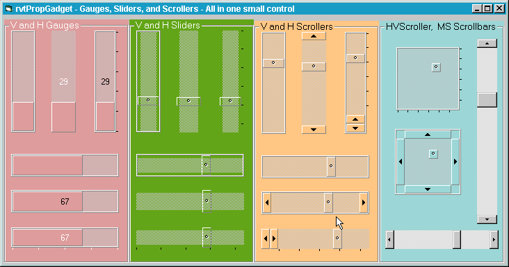



## rvtPropGadget \(v2\)

### Description

Multiple Slider, Scroller controls in one OCX. Now Mousewheel support has been added, in addition to MS properties so that it can be used as a drop-in replacement.
 
### More Info
 

             |
---                |---
**Submitted On**   |2001-12-17 11:11:26
**By**             |[Ron van Tilburg](https://github.com/Planet-Source-Code/PSCIndex/blob/master/ByAuthor/ron-van-tilburg.md)
**Level**          |Intermediate
**User Rating**    |5.0 (10 globes from 2 users)
**Compatibility**  |VB 6\.0
**Category**       |[Custom Controls/ Forms/  Menus](https://github.com/Planet-Source-Code/PSCIndex/blob/master/ByCategory/custom-controls-forms-menus__1-4.md)
**World**          |[Visual Basic](https://github.com/Planet-Source-Code/PSCIndex/blob/master/ByWorld/visual-basic.md)
**Archive File**   |[rvtPropGad483401122002\.zip](https://github.com/Planet-Source-Code/ron-van-tilburg-rvtpropgadget-v2__1-30741/archive/master.zip)

